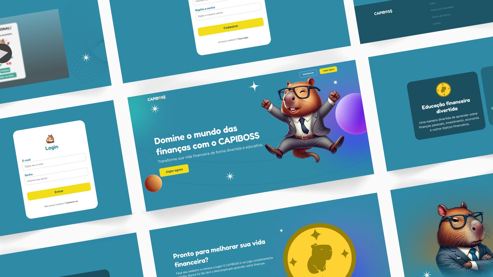

<h1 align="center"> CAPIBOSS - Equipe 6 🐗</h1>

  <a href="#-projeto">Projeto</a>&nbsp;&nbsp;&nbsp;|&nbsp;&nbsp;&nbsp;
  <a href="#-equipe">Equipe</a>&nbsp;&nbsp;&nbsp;|&nbsp;&nbsp;&nbsp;
  <a href="#-tecnologias">Tecnologias</a>

 

  

 

## 💻 Projeto

O projeto foi desenvolvido para o Desafio 4 do **Programa Trilhas do Inova Maranhão**. Este desafio é um verdadeiro teste de colaboração e criatividade. Juntamos as mentes brilhantes das trilhas de Programação Front-end, Programação Back-end, UX Design, Ciência de Dados e Jogos para resolver problemas reais e criar soluções digitais incríveis.

### O desafio:

Mexer com Financeiro nunca é fácil e, para alguns, pode ser um grande desafio. Seja por falta de noções matemáticas ou até mesmo por falta de conhecimento financeiro. Ao utilizar esse tema, criamos um jogo que possa ajudar pessoas com dificuldades de lidar com suas finanças e também uma Landing Page para cadastro de novos jogadores para esse jogo.

Desta forma, foi desenvolvido uma tarefa dentro de cada trilha para alcançarmos esse objetivo.

- Back-end: API de Cadastro de Usuários
- Front-end: Landing Page para o Cadastro dos novos Usuários
- UX Design: a UX da Landing Page e o GDD(Game Design Document) do jogo
- Jogos: O Jogo que será acessado pelo Usuário
- Dados: Dashboard com os dados coletados

 

## 🤝🏼 Equipe

Somos a Equipe 6, que é composta por:

👨🏼‍💻 Back-end:

- [Carlos Jean](https://www.linkedin.com/in/carlos-jean-132914209/)
- [Gabriel Froes](https://www.linkedin.com/in/gabriel-froes-tr/)
- [Ícaro Martins](https://www.linkedin.com/in/ícaro-martins-7a45a425a)

👩🏻‍💻 Front-end:

- [Deise Rodrigues](https://www.linkedin.com/in/deise-srodrigues/)
- [Layna Moraes](https://www.linkedin.com/in/layna-moraes/)
- [Maiara Cristina](https://www.linkedin.com/in/maiaracristina-3b9609315)
- [Roberta Soares](https://www.linkedin.com/in/roberta-de-cássia-838736223/)

✒ UX Design:

- [Luana Beatriz ](luannabeatriz0115@gmail.com)
- [Luyza Lohane](luyzalohane@gmail.com)
- [Vitor Oliveira Ferreira](vitor.oferreira25@gmail.com)

🎮 Jogos:

- 

🎲 Dados:

- 

 

## 🚀 Tecnologias

Esse projeto foi desenvolvido com as seguintes tecnologias e bibliotecas:

👨🏼‍💻 Back-end:

- Node
- MongoDB
- Express
- Swagger
- Bcrypt
- Render

 

👩🏻‍💻 Front-end:

- JavaScript
- HTML
- CSS

 

✒ UX Design:

- Figma

 

🎮 Jogos:

-

 

🎲 Dados:

-
